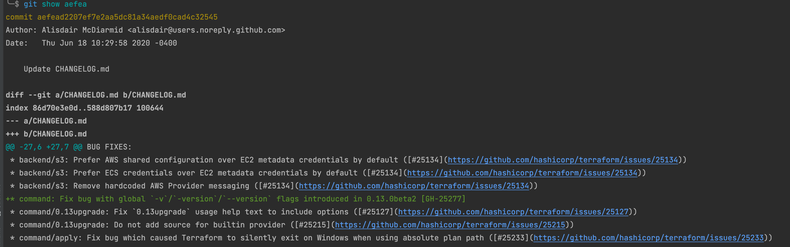
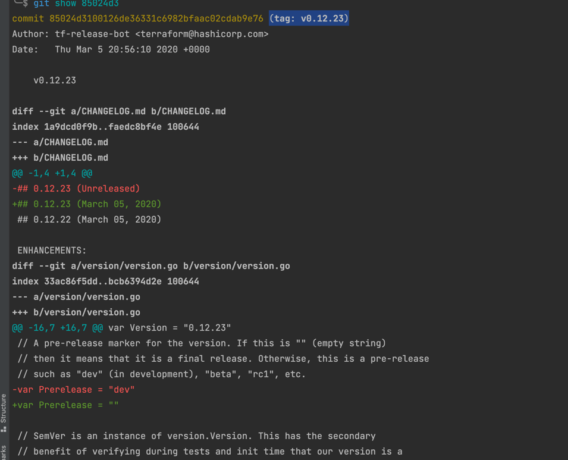
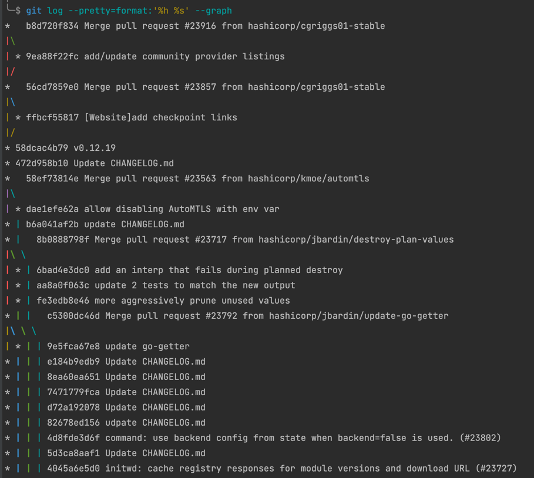
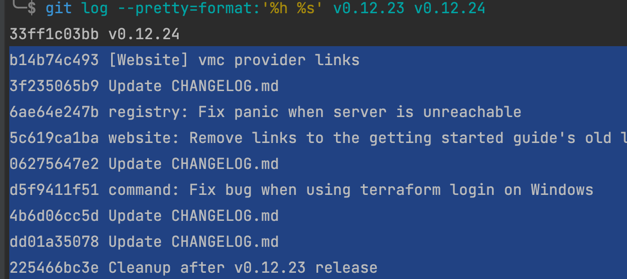
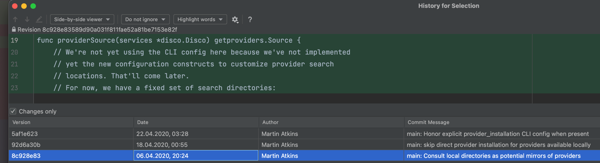
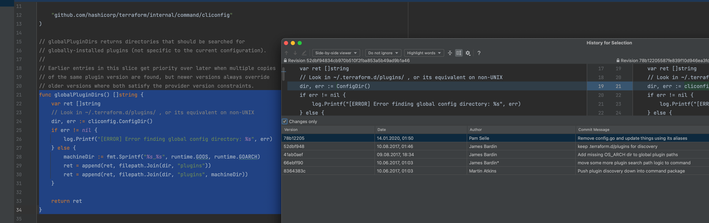
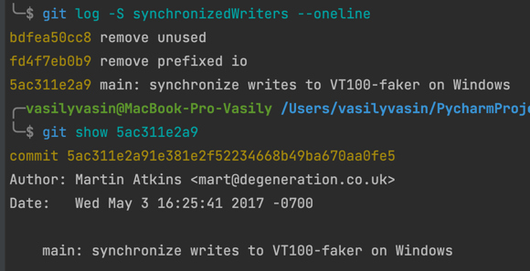

# Домашнее задание к занятию "2.4. Инструменты Git"

### Найдите полный хеш и комментарий коммита, хеш которого начинается на aefea

Полный хэш можно посмотреть командой git show.

#### Q 01. Какому тегу соответствует коммит `85024d3`?

Ответ: (tag: v0.12.23)

#### Q 02. Сколько родителей у коммита `b8d720`? Напишите их хеши.

56cd7859e0
58dcac4b79
472d958b10
58ef73814e

#### Q 03. Перечислите хеши и комментарии всех коммитов, которые были сделаны между тегами  v0.12.23 и v0.12.24.

* b14b74c493 [Website] vmc provider links
* 3f235065b9 Update CHANGELOG.md
* 6ae64e247b registry: Fix panic when server is unreachable
* 5c619ca1ba website: Remove links to the getting started guide's old location
* 06275647e2 Update CHANGELOG.md
* d5f9411f51 command: Fix bug when using terraform login on Windows
* 4b6d06cc5d Update CHANGELOG.md
* dd01a35078 Update CHANGELOG.md
* 225466bc3e Cleanup after v0.12.23 release

#### Q 04. Найдите коммит, в котором была создана функция `func providerSource`, её определение в коде выглядит так: `func providerSource(...)` (вместо троеточия перечислены аргументы).

8c928e83589d90a031f811fae52a81be7153e82f

#### Q 05. Найдите все коммиты, в которых была изменена функция `globalPluginDirs`.

Коммиты в которых была изменена функция `globalPluginDirs`. :
* 78b12205587fe839f10d946ea3fdc06719decb05	Tue Jan 14 01:50:05 SAMT 2020	Pam Selle	Remove config.go and update things using its aliases
* 52dbf94834cb970b510f2fba853a5b49ad9b1a46	Thu Aug 10 01:46:49 SAMT 2017	James Bardin	keep .terraform.d/plugins for discovery
* 41ab0aef7a0fe030e84018973a64135b11abcd70	Wed Aug 09 18:34:11 SAMT 2017	James Bardin	Add missing OS_ARCH dir to global plugin paths
* 66ebff90cdfaa6938f26f908c7ebad8d547fea17	Sat Jun 10 01:03:59 SAMT 2017	James Bardin*	move some more plugin search path logic to command
* 8364383c359a6b738a436d1b7745ccdce178df47	Sat Jun 10 01:03:59 SAMT 2017	Martin Atkins	Push plugin discovery down into command package

| Hash                                     |           Date Time           |                        Comment                        |    Author     |
|------------------------------------------|:-----------------------------:|:-----------------------------------------------------:|:-------------:|
| 78b12205587fe839f10d946ea3fdc06719decb05 | Tue Jan 14 01:50:05 SAMT 2020 | Remove config.go and update things using its aliases  |   Pam Selle   |
| 52dbf94834cb970b510f2fba853a5b49ad9b1a46 | Thu Aug 10 01:46:49 SAMT 2017 |        keep .terraform.d/plugins for discovery        |  James Bardi  |
| 41ab0aef7a0fe030e84018973a64135b11abcd70 | Wed Aug 09 18:34:11 SAMT 2017 |    Add missing OS_ARCH dir to global plugin paths     |  James Bardi  |
| 66ebff90cdfaa6938f26f908c7ebad8d547fea17 | Sat Jun 10 01:03:59 SAMT 2017 |  move some more plugin search path logic to command   |  James Bardi  |
| 8364383c359a6b738a436d1b7745ccdce178df47 | Sat Jun 10 01:03:59 SAMT 2017 |    Push plugin discovery down into command package    | Martin Atkins |

#### Q 06. Кто автор функции `synchronizedWriters`? 

* фнукия была создана Martin Atkins May 3 16:25:41 2017
* ищем по истории `git log -S synchronizedWriters --oneline`
* смотрим самый первые коммит `git show 5ac311e2a9`
