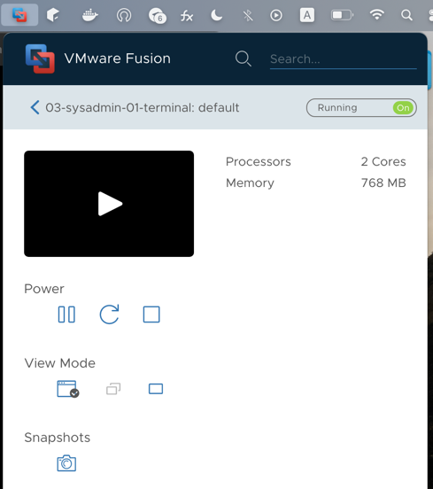

# Домашнее задание к занятию "3.1. Работа в терминале, лекция 1"


### Поскольку у меня чип M1 - возможность запуска виртуальных машин ограничена, поэтому я не смог выполнить задание по установке виртуальной машины Vagrant + VirtualBox. Вместо этого я установил Vagrant + VMware для Mac.

#### Q 01. Какие ресурсы выделены по-умолчанию?
По умолчанию выделены 2 ядра процессора и 768 МБ оперативной памяти.  


#### Q 02. Как добавить оперативной памяти или ресурсов процессора виртуальной машине?
Добавить параметры формата {vm}.memory = {value} и {vm}.cpus = {value} в файл Vagrantfile.
Например 
vmware.cpus = 2
vmware.memory = 2048

#### Q 03. Какой переменной можно задать длину журнала history, и на какой строчке manual это описывается?
1. HISTFILESIZE - максимальное число строк в файле истории для сохранения, строка 685 в man Bash
2. HISTSIZE - число команд для сохранения, строка 2459 в в man Bash
#### Q 04. Что делает директива ignoreboth в bash?
В системе есть переменная HISTCONTROL.  
HISTCONTROL контролирует каким образом список команд сохраняется в истории.
- ignorespace — не сохранять строки начинающиеся с символа <пробел>
- ignoredups — не сохранять строки, совпадающие с последней выполненной командой
- ignoreboth — использовать обе опции ‘ignorespace’ и ‘ignoredups’
- erasedups — удалять ВСЕ дубликаты команд с истории  

#### Q 05. В каких сценариях использования применимы скобки {} и на какой строчке man bash это описано?
В Bash, фигурные скобки {} используются для создания набора символов или чисел в соответствии с шаблоном. Они могут использоваться для перечисления файлов или каталогов, генерации списка чисел или для выполнения команд для каждого элемента в наборе. Например, touch file{1..5}.txt создаст файлы file1.txt, file2.txt, file3.txt, file4.txt, file5.txt . или rm file{a..e}.txt удалит файлы filea.txt, fileb.txt, filec.txt, filed.txt, filee.txt.
строка 220

#### Q 06. С учётом ответа на предыдущий вопрос, как создать однократным вызовом touch 100000 файлов? Получится ли аналогичным образом создать 300000? Если нет, то почему?
Команда: touch {000001..100000}.txt
300000 файлов не получится создать, так как выводит ошибку -bash: /usr/bin/touch: Argument list too long
Так как 2097152 - максимальное количество аргументов, которые можно передать в командную строку. (команда для прокерки getconf ARG_MAX)
#### Q 07. В man bash поищите по /\[\[. Что делает конструкция ```bash [[ -d /tmp ]]```
Конструкция [[ condition ]] используется для проверки условий. Она возвращает 0, если условие истинно, и 1, если условие ложно. Она может использоваться вместо test. Она также поддерживает дополнительные условия, такие как регулярные выражения и строковые сравнения.  
[[ -d /tmp ]] - проверяет существует ли директория /tmp  
Пример использования:
```bash
if [[ -d /tmp ]]
then
    echo "Папка существует"
else
    echo "Ошибка, такой папки нет"
fi
```  

#### Q 08. Сделайте так, чтобы в выводе команды type -a bash первым стояла запись с нестандартным путем, например bash is ... Используйте знания о просмотре существующих и создании новых переменных окружения, обратите внимание на переменную окружения PATH
```bash
bash is /tmp/new_path_directory/bash
bash is /usr/local/bin/bash
bash is /bin/bash
```  
Решение:
```bash
mkdir -p /tmp/new_path_directory/bash
cp /bin/bash /tmp/new_path_directory/bash
PATH=/tmp/new_path_directory/bash:$PATH
type -a bash
```
#### Q 09. Чем отличается планирование команд с помощью batch и at?
#### batch 
- планирование команд с помощью batch выполняется в очереди пакетов, когда позволяет уровень загрузки системы. По умолчанию задания выполняются, когда средняя загрузка системы ниже 1,5. Значение загрузки может быть указано при вызове демона atd. Если средняя загрузка системы выше указанной, задания будут ждать в очереди.  
#### at
- планирование команд с помощью at выполняется в определенное время, которое задается в формате HH:MM YYYY-MM-DD.


