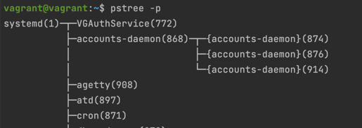

# Домашнее задание к занятию "3.2. Работа в терминале, лекция 2"

#### Q 01. Какого типа команда cd?
cd - это встроенная в bash команда, которая используется для перехода в директорию, указанную в качестве аргумента.  
```bash
type -a cd
cd is a shell builtin
```  

#### Q 02. Какая альтернатива без pipe команде grep <some_string> <some_file> | wc -l?
Можно воспользоваться командой `grep -c <some_string> <some_file>`, которая выведет количество совпадений в файле.  

#### Q 03. Какой процесс с PID 1 является родителем для всех процессов в вашей виртуальной машине Ubuntu 20.04?
На виртуальной машине  - systemd:


#### Q 04. Как будет выглядеть команда, которая перенаправит вывод stderr ls на другую сессию терминала?
Конструкция Commant 2>/dev/pts/1 
Например ls \root 2>/dev/pts/1
Результат:  


#### Q 05. Получится ли одновременно передать команде файл на stdin и вывести ее stdout в другой файл?
- echo 'Получится ли одновременно передать команде файл на stdin и вывести ее stdout в другой файл?' > test
- cat < test > test2
- cat test2  
Получится. Результат:  

#### Q 06. Получится ли, находясь в графическом режиме, вывести данные из PTY в какой-либо из эмуляторов TTY? Сможете ли вы наблюдать выводимые данные?
Да, такое возможно. Например, можно воспользоваться командой `echo "test" > /dev/tty1`.
#### Q 07. Выполните команду bash 5>&1. К чему она приведет? Что будет, если вы выполните echo netology > /proc/$$/fd/5? Почему так происходит?
Команда `bash 5>&1` приведет к тому, что файловый дескриптор 5 будет указывать на stdout.
`echo netology > /proc/$$/fd/5` - перенаправит результат команды в дескриптор 5, тоесть на stdout bash.

#### Q 08. Получится ли в качестве входного потока для pipe использовать только stderr команды, не потеряв при этом отображение stdout на pty?
Команда `ll /root 3>&2 2>&1 1>&3` - да, получится.
 
3>&2 - новый дескриптор перенаправили в stderr   23:: 191:: 1451::
2>&1 - stderr перенаправили в stdout    
1>&3 - stdout - перенаправили в в новый дескриптор  

#### Q 09. Что выведет команда cat /proc/$$/environ? Как еще можно получить аналогичный по содержанию вывод?
Будут выведены переменные окружения. Так же можно повторить вывод командой `env` или `printenv`.

#### Q 10. Используя man, опишите что доступно по адресам /proc/<PID>/cmdline, /proc/<PID>/exe
`/proc/<PID>/cmdline` - (строка 191 man) Этот доступный только для чтения файл содержит полную командную строку для процесса, если этот процесс не является зомби. В последнем случае ничего не этот файл: то есть чтение этого файла вернет 0 символов.  
`/proc/<PID>/exe` - (строка 238 man) Этот файл представляет собой символическую ссылку, содержащую фактический путь к выполняемой команде. Эта символическая ссылка может быть разыменована обычным образом; попытка открыть его откроет исполняемый файл. 

#### Q 11. Узнайте, какую наиболее старшую версию набора инструкций SSE поддерживает ваш процессор с помощью /proc/cpuinfo.
В моем дистрибутиве нет поддержки sse. При вызове `cat /proc/cpuinfo | grep sse` вывод пустой.
#### Q 12. При открытии нового окна терминала и vagrant ssh создается новая сессия и выделяется pty. Однако vagrant@netology1:~$ ssh localhost 'tty' not a tty Почему так происходит, и как изменить поведение.
По умолчанию при запуске команды через SSH не выделяется TTY. Если же не указывать команды, то TTY будет выдаваться, так как предполагается, что будет запущен сеанс оболочки. Изменить поведение можно через команду `ssh localhost`, авторизоваться и выполнить команду 'tty'.  
Для запуска можно добавить -t - , и команда исполняется c принудительным созданием псевдотерминала.

#### Q 13. Бывает, что есть необходимость переместить запущенный процесс из одной сессии в другую. Попробуйте сделать это, воспользовавшись reptyr. Например, так можно перенести в screen процесс, который вы запустили по ошибке в обычной SSH-сессии.
`reptyr -T <PID>` - переносит процесс в новую сессию. Для реализации необходимо установить значение ```kernel.yama.ptrace_scope = 0```
#### Q 14. Узнайте? что делает команда tee и почему в отличие от sudo echo команда с sudo tee будет работать.
tee - получает значения из stdin и записывает их в stdout и файл. Так как tee запускается отдельным процессом из-под sudo, то получая в stdin через pipe данные от echo - у нее есть права записать в файл.

