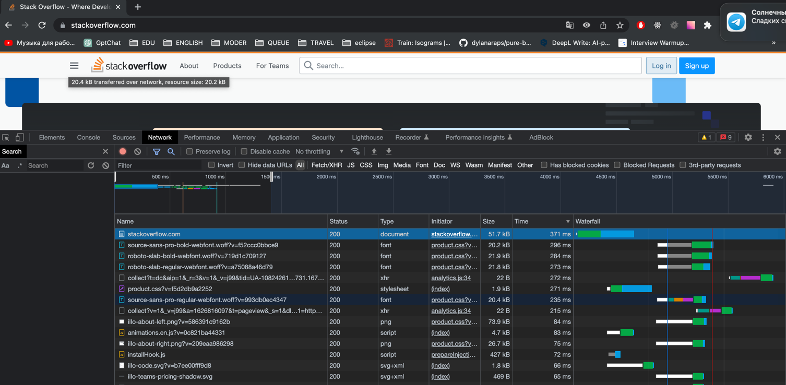

# Домашнее задание к занятию "3.2. Работа в терминале, лекция 2"

#### Q 01. Работа c HTTP через телнет. Подключитесь утилитой телнет. В ответе укажите полученный HTTP код, что он означает?
Ответ сервера 403 Forbidden. Означает отсутствие доступа к материалу на странице.

#### Q 02. Повторите задание 1 в браузере, используя консоль разработчика F12.
- найдите первый ответ HTTP сервера, откройте вкладку Headers. Укажите в ответе полученный HTTP код  
  - 307 Internal Redirect  
- проверьте время загрузки страницы, какой запрос обрабатывался дольше всего?
  - Дольше всего обрабатывался запрос шрифта source-sans-pro-bold-webfont.woff?v=f52ccc0bbce9 Время обработки 371 ms
- приложите скриншот консоли браузера в ответ.
  - 
  
#### Q 03. Какой IP адрес у вас в интернете?
```dig @resolver1.opendns.com myip.opendns.com +short```  
Ответ: 78.185.223.68

#### Q 04. Какому провайдеру принадлежит ваш IP адрес? Какой автономной системе AS? Воспользуйтесь утилитой whois
netname:        TurkTelekom  
origin:         AS9121

#### Q 05. Через какие сети проходит пакет, отправленный с вашего компьютера на адрес 8.8.8.8? Через какие AS? Воспользуйтесь утилитой traceroute
```
traceroute to 8.8.8.8 (8.8.8.8), 30 hops max, 60 byte packets
 1  192.168.215.2 [*]  2.270 ms  2.280 ms  2.276 ms
 2  192.168.1.1 [*]  6.506 ms  6.501 ms  6.484 ms
 3  78.185.208.1 [AS9121]  15.096 ms  15.105 ms  15.089 ms
 4  81.212.72.147 [AS9121]  13.514 ms  13.104 ms  13.485 ms
 5  81.212.218.85 [AS9121]  19.869 ms  20.141 ms  20.118 ms
 6  81.212.30.7 [AS9121]  20.107 ms  19.686 ms  19.576 ms
 7  212.156.104.162 [AS9121]  37.561 ms  36.873 ms  36.759 ms
 8  72.14.204.8 [AS15169]  33.322 ms 72.14.212.14 [AS15169]  35.599 ms 72.14.204.10 [AS15169]  39.319 ms
 9  * * *
10  8.8.8.8 [AS15169/AS263411]  34.404 ms  34.657 ms  35.136 ms
```

#### Q 06. Повторите задание 5 в утилите mtr. На каком участке наибольшая задержка - delay?
Наибольшее время задержки на участке 5. AS9121 81.212.218.85 - 128.4 ms  
```bash
mtr -zn 8.8.8.8
```
```bash
 Host                                                                                                                                     Loss%   Snt   Last   Avg  Best  Wrst StDev
 1. AS???    192.168.215.2                                                                                                                 0.0%    86    0.5   0.7   0.3   9.4   1.2
 2. AS???    192.168.1.1                                                                                                                   0.0%    86    6.0   4.8   2.6  28.6   3.2
 3. AS9121 4733178.185.208.1                                                                                                               0.0%    86   13.3  16.1  10.4  60.2   9.3
 4. AS9121   81.212.72.147                                                                                                                 0.0%    86   15.7  13.0   9.5  76.1   7.6
 5. AS9121   81.212.218.85                                                                                                                 0.0%    86   21.2  20.6  16.9 128.4  12.3
 6. AS9121   81.212.30.7                                                                                                                  15.3%    85   17.8  19.0  16.6  36.2   3.0
 7. AS9121   212.156.104.162                                                                                                               0.0%    85   35.4  37.9  35.4  87.9   5.9
 8. AS15169  72.14.204.8                                                                                                                   0.0%    85   31.8  33.8  31.4  70.7   4.8
 9. AS15169  216.239.59.239                                                                                                                0.0%    85   31.9  34.1  31.4  47.4   3.0
10. AS15169  142.250.56.111                                                                                                                0.0%    85   37.7  39.6  36.7  60.6   3.7
11. AS15169  8.8.8.8                                                                                                                       0.0%    85   31.5  33.8  31.3  47.3   2.9

```
#### Q 07. Какие DNS сервера отвечают за доменное имя dns.google? Какие A записи? Воспользуйтесь утилитой dig
```bash
dig dns.google NS +short
dig dns.google A +short
```

```bash
dns.google.             21353   IN      NS      ns3.zdns.google.
dns.google.             21353   IN      NS      ns2.zdns.google.
dns.google.             21353   IN      NS      ns1.zdns.google.
dns.google.             21353   IN      NS      ns4.zdns.google.

dns.google.             5       IN      A       8.8.8.8
dns.google.             5       IN      A       8.8.4.4
```
#### Q 08. Проверьте PTR записи для IP адресов из задания 7. Какое доменное имя привязано к IP? Воспользуйтесь утилитой dig
```bash
dig -x 8.8.8.8
```
```bash
;; QUESTION SECTION:
;8.8.8.8.in-addr.arpa.          IN      PTR

;; ANSWER SECTION:
8.8.8.8.in-addr.arpa.   5       IN      PTR     dns.google.

```
