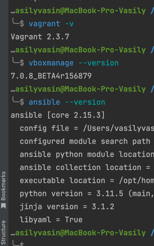
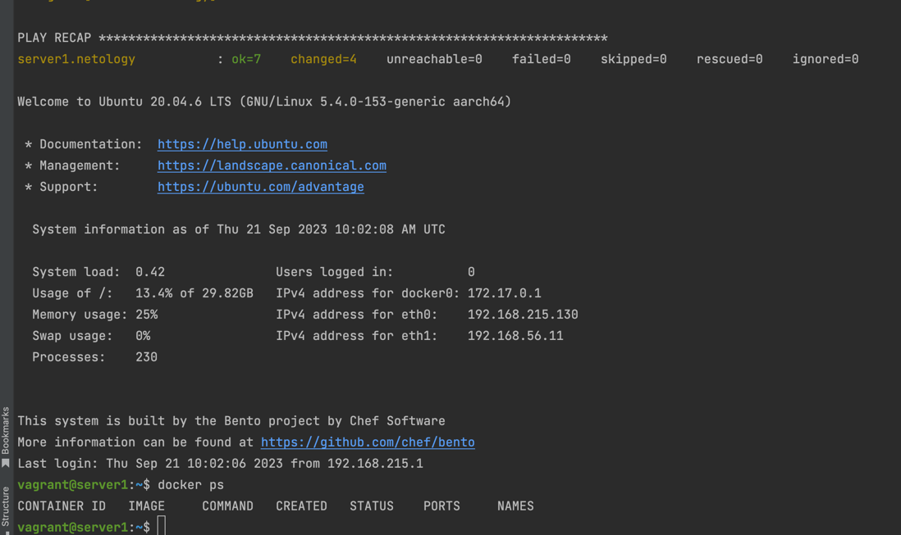

# Домашнее задание к занятию 2. «Применение принципов IaaC в работе с виртуальными машинами»

### Q 01. 
#### Опишите основные преимущества применения на практике IaaC-паттернов.
Преимущества применения IaaS-паттернов на практике:
* Быстрое развертывание: Готовые конфигурации инфраструктуры сокращают время запуска проектов.
* Меньше ошибок: Предварительная настройка снижает вероятность ошибок.
* Масштабируемость: Легко масштабировать ресурсы под нагрузкой.
* Управление кодом: Можно управлять инфраструктурой как кодом и автоматизировать процессы.
* Безопасность: Можно включать стандарты безопасности и средства обеспечения безопасности.
* Упрощение миграции: Легко перемещать инфраструктуру между облачными поставщиками.
* Эффективное использование ресурсов: Оптимизация ресурсов и снижение затрат.
* Контроль версий: Ведение учета изменений и контроль версий.
* Сотрудничество: Общие ресурсы для совместной работы.
#### Какой из принципов IaaC является основополагающим?
Основополагающим принципом IaaS (Infrastructure as Code) является "Инфраструктура как код" (Infrastructure as Code, IaC).  
Этот принцип заключается в том, что инфраструктура, такая как серверы, сети, хранилища и другие ресурсы, управляется и настраивается с использованием кода, а не вручную.

### Q 02. 
#### Чем Ansible выгодно отличается от других систем управление конфигурациями?
Ansible выгодно отличается от других систем управления конфигурациями следующими преимуществами:
* Простота использования и понимания.
* Агентлесс архитектура — не требует дополнительных агентов на управляемых узлах.
* Языковая нейтральность — не привязан к конкретному языку программирования.
* Модульность и расширяемость — можно создавать собственные модули.
* Интеграция с различными инфраструктурными платформами и облачными провайдерами.
* Поддержка контроля версий и согласованных конфигураций.
* Активное сообщество и богатая экосистема с готовыми ролями и плейбуками.
* Высокая скорость выполнения задач.

#### Какой, на ваш взгляд, метод работы систем конфигурации более надёжный — push или pull?
Выбор между методами работы систем конфигурации (push и pull) зависит от конкретных потребностей и контекста инфраструктуры. Оба метода имеют свои преимущества и недостатки, и надежность зависит от правильной реализации и управления ими. 

### Q 03. Приложите вывод команд установленных версий каждой из программ, оформленный в Markdown.

### Q 04. Приложите скриншоты в качестве решения.
К сожалению, у меня машина MAC на M1. Поэтому связка VirtualBox и Vagrant не работает. 
Но я не отчаиваюсь и немного подправил Vagrantfile под связку VirtualBox и VmWare. 
Касательно образа ubuntu - тоже пришлось перейти на его arm версию
Вот результат:
