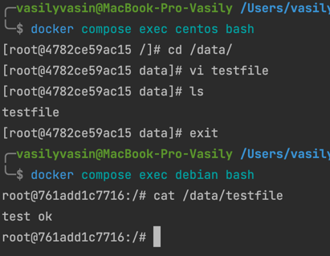

# Домашнее задание к занятию "3.7. Компьютерные сети. Лекция 2"

#### Q 01. Опубликуйте созданный fork в своём репозитории и предоставьте ответ в виде ссылки на него.

[- Ссылка на репозиторий](https://hub.docker.com/r/vavasin/nginx-fork-nginx)

#### Q 02. Посмотрите на сценарий ниже и ответьте на вопрос: «Подходит ли в этом сценарии использование Docker-контейнеров или лучше подойдёт виртуальная машина, физическая машина? Может быть, возможны разные варианты?»
- высоконагруженное монолитное Java веб-приложение;  
Я склоняюсь к тому, чтобы вывести его на отдельный сервер, так как Java - ресурсоемкое приложение и дополнительная контейнеризация может сказаться на производительности.
- Nodejs веб-приложение;  
Однозначно подходит для Docker контейнера
- мобильное приложение c версиями для Android и iOS;  
Сложно ответить на этот вопрос, так как не знаком с мобильной разработкой. Однако думаю эти приложения можно развернуть в контейнерах хотя бы потому, что проще делать сборку и автодеплой.
- шина данных на базе Apache Kafka;  
Подходит для Docker контейнера
- Elasticsearch-кластер для реализации логирования продуктивного веб-приложения — три ноды elasticsearch, два logstash и две ноды kibana;  
- мониторинг-стек на базе Prometheus и Grafana;  
Подходит для Docker контейнера
- MongoDB как основное хранилище данных для Java-приложения;  
Этот кейс я бы развернул на отдельном сервере, так как базы данных лучше держать и админить отдельно.
- Gitlab-сервер для реализации CI/CD-процессов и приватный (закрытый) Docker Registry.  
Эти сервисы я бы сделал на отдельном сервере без контейнеризации
#### Q 03.  

