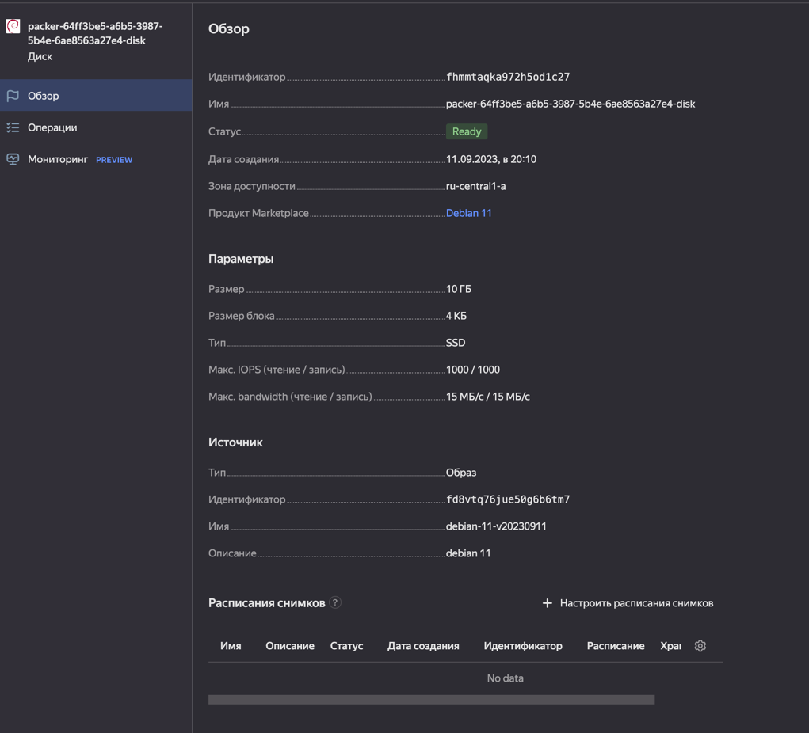
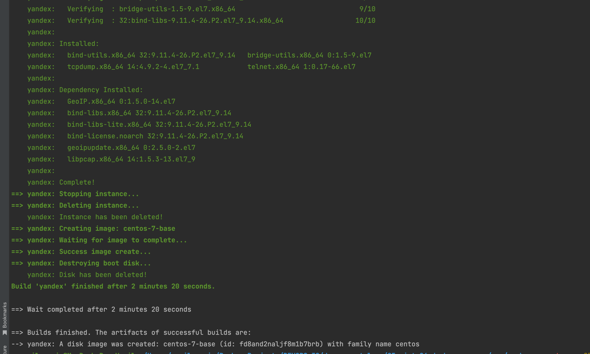
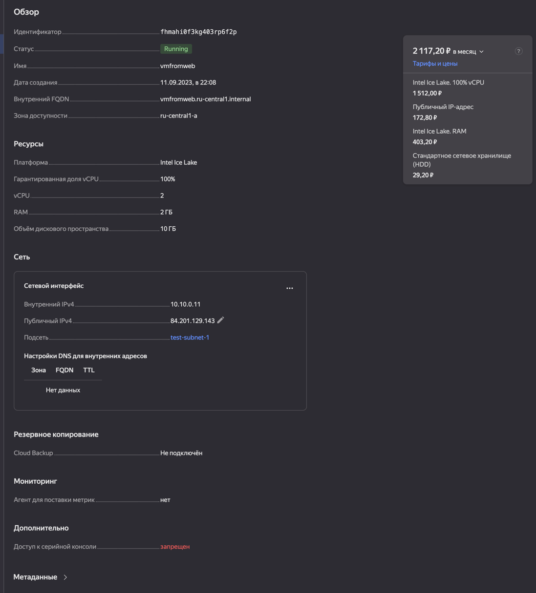
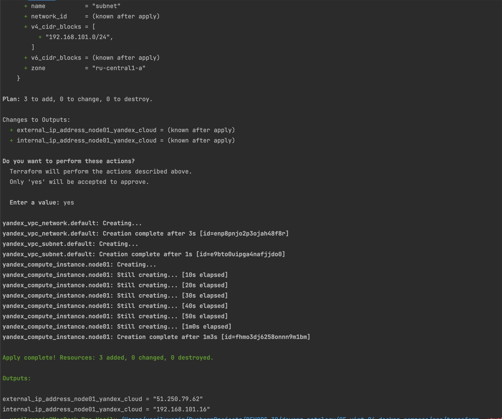
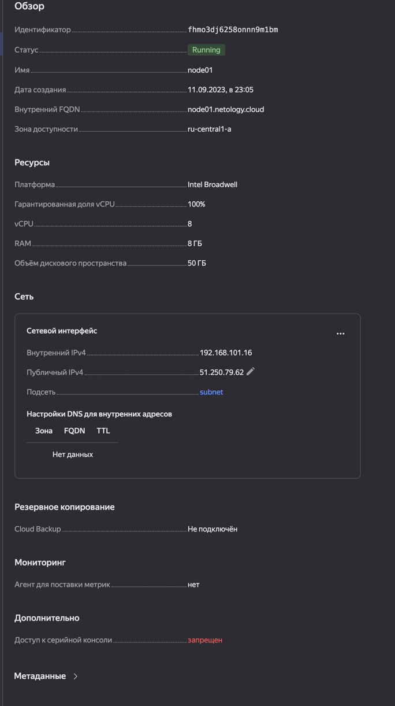
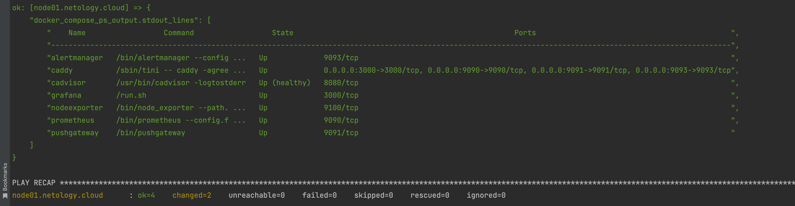
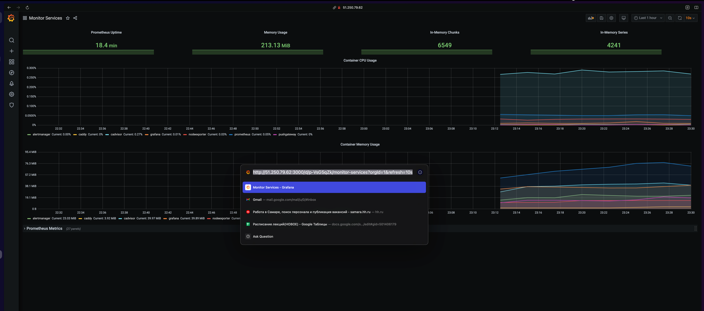

# Домашнее задание к занятию "4. «Оркестрация группой Docker-контейнеров на примере Docker Compose»"

#### Q 01. Создайте собственный образ любой операционной системы (например, debian-11) с помощью Packer версии 1.5.0.
- Чтобы получить зачёт, вам нужно предоставить скриншот страницы с созданным образом из личного кабинета YandexCloud.  
- по инструкции yandex

- по файлу из src/packer

#### Q 02. Создайте вашу первую виртуальную машину в YandexCloud с помощью web-интерфейса YandexCloud.
Чтобы получить зачёт, вам нужно предоставить страницу свойств, созданной ВМ из личного кабинета YandexCloud.  
- в web-итерфейсе

- через terraform

#### Q 03. С помощью Ansible и Docker Compose разверните на виртуальной машине из предыдущего задания систему мониторинга на основе Prometheus/Grafana.
Чтобы получить зачёт, вам нужно предоставить вывод команды "docker ps", все контейнеры, описанные в docker-compose, должны быть в статусе "Up".  
- пайплайн для вывода docker-ps.yml
- запуск ansible-playbook -v docker-ps.yml

#### Q 04. Изучите доступный интерфейс, найдите в интерфейсе автоматически созданные docker-compose-панели с графиками(dashboards).

