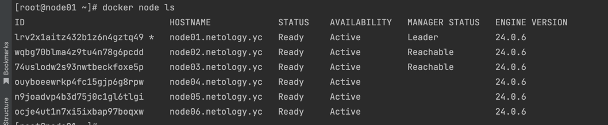
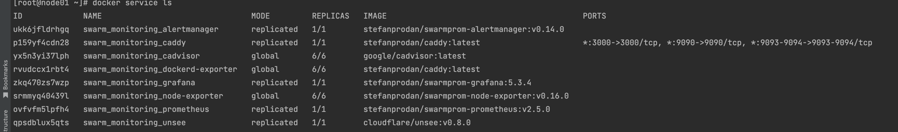

# Домашнее задание к занятию 5. «Оркестрация кластером Docker контейнеров на примере Docker Swarm»

### Q 01. Создайте собственный образ любой операционной системы (например, debian-11) с помощью Packer версии 1.5.0.
#### В чём отличие режимов работы сервисов в Docker Swarm-кластере: replication и global?
- REPLICATION
- В режиме репликации сервис разворачивается в заданном количестве реплик (копий) по всему кластеру Docker Swarm. Вы указываете желаемое количество реплик при создании сервиса.
- Каждая реплика сервиса работает независимо и может быть размещена на любом доступном узле в кластере. Это позволяет распределить нагрузку и обеспечить отказоустойчивость.
- Режим репликации подходит для приложений, которые могут быть масштабированы горизонтально и где каждая реплика обслуживает одну и ту же версию приложения.  

- GLOBAL
- В режиме Global каждый узел в кластере Docker Swarm получает копию сервиса. То есть каждый узел будет запускать одну и ту же версию сервиса.
- Режим Global подходит для приложений, которые должны быть развернуты на каждом узле кластера, например, для служб мониторинга, сбора журналов и т. д.

#### Какой алгоритм выбора лидера используется в Docker Swarm-кластере?
- Docker Swarm использует алгоритм выбора лидера, называемый "Raft", для управления состоянием и определения лидера в кластере. 
Raft - это распределенный алгоритм консенсуса, который обеспечивает высокую доступность и согласованность данных в распределенной системе.

#### Что такое Overlay Network?
- Overlay Network (сеть типа "Overlay") в Docker Swarm - это сеть, которая предоставляет возможность коммуникации между сервисами, развернутыми в Docker Swarm-кластере, независимо от того, на каком узле они запущены. 
Эта сеть создается поверх существующей инфраструктуры сети и обеспечивает распределенное соединение между контейнерами, работающими в разных частях кластера.

### Q 02. Создайте ваш первый Docker Swarm-кластер в Яндекс Облаке.
Чтобы получить зачёт, предоставьте скриншот из терминала (консоли) с выводом команды:

### Q 03. Создайте ваш первый, готовый к боевой эксплуатации кластер мониторинга, состоящий из стека микросервисов.
Чтобы получить зачёт, предоставьте скриншот из терминала (консоли), с выводом команды:

