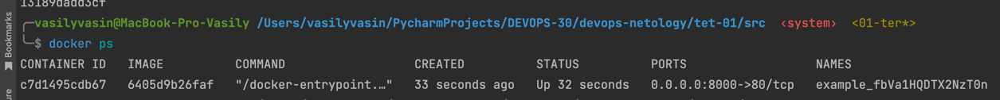
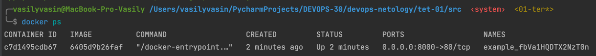

# Домашнее задание к занятию «Введение в Terraform»

### Q 01. 
#### 2 Изучите файл .gitignore. В каком terraform-файле, согласно этому .gitignore, допустимо сохранить личную, секретную информацию?
- В файле personal.auto.tfvars

#### 3 Найдите в state-файле секретное содержимое созданного ресурса random_password, пришлите в качестве ответа конкретный ключ и его значение.
- "result": "fbVa1HQDTX2NzT0n" 

#### 4 Раскомментируйте блок кода, примерно расположенный на строчках 29–42 файла main.tf. Выполните команду terraform validate. Объясните, в чём заключаются намеренно допущенные ошибки. Исправьте их.
- после resource "docker_image" должен идти название "nginx"
- Название ресурсов не должны начинаться с цифр
- правильно написать random_password.random_string.result вместо random_string_FAKE.resulT

#### 5 Выполните код. В качестве ответа приложите: исправленный фрагмент кода и вывод команды docker ps


#### 6 Объясните своими словами, в чём может быть опасность применения ключа -auto-approve. В качестве ответа дополнительно приложите вывод команды docker ps.
- Неосторожность: Если случайно запустить terraform apply с опцией -auto-approve, то любые изменения в инфраструктуре будут автоматически применены без возможности их проверки и подтверждения. 
- Отсутствие контроля: Используя -auto-approve, теряется возможность контролировать и оценивать изменения перед их применением
- Потеря данных: Если изменения в инфраструктуре приведут к потере данных или нежелательным действиям (например, удалению важных ресурсов), то использование -auto-approve может быть критически важной ошибкой

#### 7 Уничтожьте созданные ресурсы с помощью terraform. Убедитесь, что все ресурсы удалены. Приложите содержимое файла terraform.tfstate.
```json
{
  "version": 4,
  "terraform_version": "1.4.6",
  "serial": 9,
  "lineage": "7dd56273-6048-3558-3230-4ea0b25b466c",
  "outputs": {},
  "resources": [],
  "check_results": null
}
```

#### 8. Объясните, почему при этом не был удалён docker-образ nginx:latest. Ответ обязательно подкрепите строчкой из документации terraform провайдера docker. (ищите в классификаторе resource docker_image )
- потому что у нас стоит параметр keep_locally
- keep_locally (Boolean) If true, then the Docker image won't be deleted on destroy operation. If this is false, it will delete the image from the docker local storage on destroy operation.